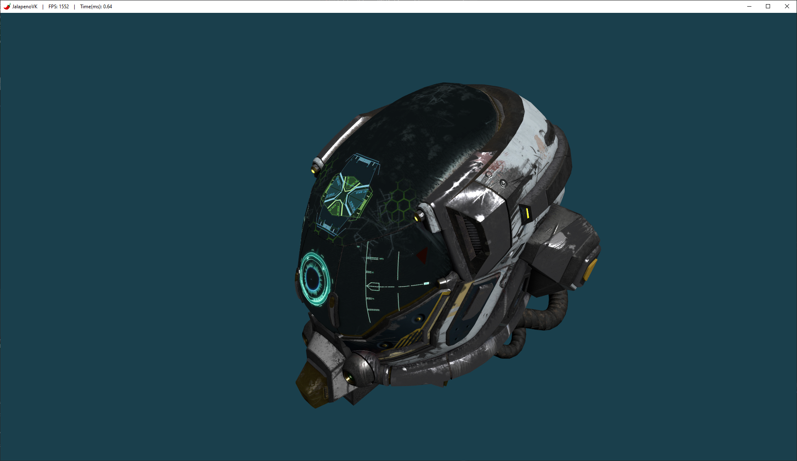

# JalapenoVK 🌶️

A personal Vulkan rendering engine written in C++20. Built as a learning project to explore modern Vulkan 1.4.

> **Status: work in progress.** Renders `DamagedHelmet` (glTF) with full metallic-roughness PBR shading — Cook-Torrance BRDF (GGX distribution, Smith geometry, Fresnel-Schlick) driven by a directional light — plus MSAA and a free-fly camera. The Scene supports composing multiple entities via components (transform, mesh, camera, light); materials are polymorphic (`Material` base + a concrete `PBRMaterial`, more shading models planned) and each owns its own per-primitive descriptor set. There's no IBL yet, so ambient light is a flat placeholder until that lands. Internals are being iterated on, expect the architecture to keep evolving.



## Tech Stack

| | |
|---|---|
| **Graphics API** | Vulkan 1.4 via Vulkan-Hpp (`vk::raii`) |
| **Shaders** | [Slang](https://shader-slang.com/) → SPIR-V 1.4 |
| **Windowing** | GLFW |
| **Math** | GLM |
| **Model loading** | tinygltf (glTF 2.0) |
| **Texture loading** | libktx (KTX2) + stb_image (JPG/PNG) |
| **Build system** | CMake 3.29 + vcpkg |
| **Compiler / Platform** | MSVC C++20 on Windows |

## Features

- **Pass-based Dynamic Rendering**
- **Entity-Component Composition**
- **Metallic-Roughness PBR Shading** (Cook-Torrance: GGX distribution + Smith geometry + Fresnel-Schlick)
- **Polymorphic Material System**
- **Directional Lighting**
- **Free-fly Camera** (WASD + Alt+mouse look)
- **Typed Resource Manager**
- **glTF 2.0 Mesh Loading** (multi-primitive, multi-material)
- **KTX2 and JPG/PNG Textures**
- **MSAA**
- **Framebuffer Resize Handling**


## Architecture

- **`VulkanContext`** — Instance, device, queues, command pool, and some helpers. Owns all global GPU state.
- **`Swapchain`** — image views, sync objects, and full recreation on resize.
- **`RenderPass` + `RenderPassManager`** — abstraction for ordering render passes without going full render-graph yet.
- **`GeometryPass`** — self-contained pass that owns everything specific to its rendering: MSAA/depth attachments and the pipeline. Binds a per-frame descriptor set (set 0: view/proj/light/camera) plus each primitive's own material descriptor set (set 1) at draw time.
- **`Material` / `PBRMaterial`** — polymorphic material base (room for future shading models beyond PBR) with one concrete metallic-roughness implementation. Each material owns its own descriptor set.
- **`DescriptorAllocator`** — shared helper for descriptor pool/set creation, used by render passes and materials.
- **`Renderer`** — thin coordinator: builds `FrameData` each frame, drives the acquire/present cycle, orchestrates command buffers.
- **`Scene`** — owns entities (`Entity` + `Component` composition: transform, mesh, camera, camera controller, light) and tracks the active camera and light.
- **`ResourceManager`** — central registry for loadable engine resources (`Texture`, `Mesh`, `Shader`). `Mesh` parses every glTF primitive and its material, resolving texture slots.

## Building

### Prerequisites

- [Vulkan SDK 1.4.335+](https://vulkan.lunarg.com/) — includes `slangc` for shader compilation.
- [vcpkg](https://vcpkg.io/) with the following packages: `glfw3`, `glm`, `tinygltf`, `ktx`, `tinyobjloader`, `stb`.
- CMake 3.29+.
- Visual Studio 2022 (or any C++20-capable compiler on Windows).

### Steps

```bat
cmake -S . -B build -DCMAKE_TOOLCHAIN_FILE=<path_to_vcpkg>/scripts/buildsystems/vcpkg.cmake
cmake --build build
```

The compiled binary and shaders are placed under `build/JalapenoVK/`.

## Project Structure

```
JalapenoVK/
├── src/
│   ├── core/          # Vulkan backend (context, device, includes)
│   ├── io/            # Window (GLFW window/icon/title) + InputManager (keyboard/mouse polling)
│   ├── materials/     # Material class hierarchy (Material base + PBRMaterial)
│   ├── render/        # Renderer, swapchain, per-frame types
│   │   └── passes/    # RenderPass base + manager + concrete passes
│   ├── resources/     # Resource system (meshes, textures, shaders)
│   ├── scene/         # Entity + components (ECS-style composition)
│   └── main.cpp
├── shaders/           # Slang shader sources (compiled to SPIR-V at build time)
├── assets/            # jalapeno_logo.png, viking_room, and DamagedHelmet (mesh + textures) are versioned
└── CMakeLists.txt
```

## License

See [LICENSE](LICENSE).
