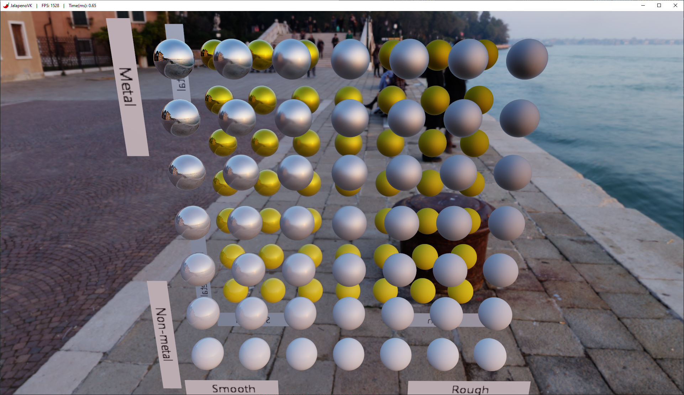
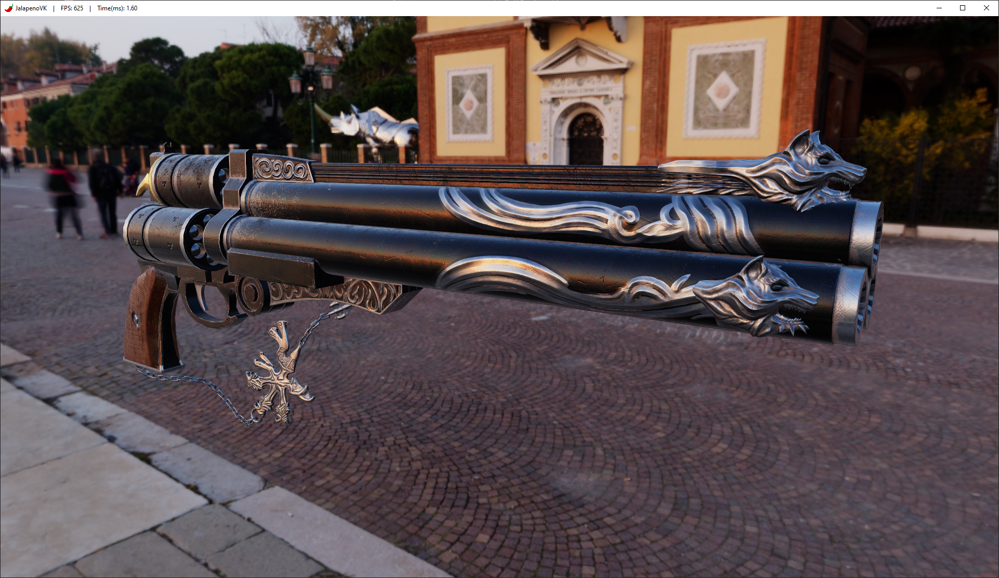

# JalapenoVK 🌶️

A personal Vulkan rendering engine written in C++20. Built as a learning project to explore modern Vulkan 1.4.

> **Status: work in progress.** Renders glTF models with metallic-roughness PBR shading (Cook-Torrance: GGX distribution, Smith geometry, Fresnel-Schlick) lit by image-based lighting, with the same environment drawn behind them as a skybox. The Scene composes entities from components (transform, mesh, camera, light), and materials are polymorphic (`Material` base + a concrete `PBRMaterial`). The directional light path is still in place but disabled in the default scene: the environment carries all the lighting until shadows land. Internals are being iterated on, expect the architecture to keep evolving.


<p align="center">
  
  
</p>

*Left: Khronos `MetalRoughSpheres`, metallic from top to bottom and roughness from left to right. Right: Cerberus by Andrew Maximov under a different HDRI. Neither asset is included in the repository (see [Credits](#credits)).*

## Tech Stack

| | |
|---|---|
| **Graphics API** | Vulkan 1.4 via Vulkan-Hpp (`vk::raii`) |
| **Shaders** | [Slang](https://shader-slang.com/) → SPIR-V 1.4 |
| **Windowing** | GLFW |
| **Math** | GLM |
| **Model loading** | tinygltf (glTF 2.0) |
| **Texture loading** | libktx (KTX2) + stb_image (JPG/PNG, HDR) |
| **Build system** | CMake 3.29 + vcpkg |
| **Compiler / Platform** | MSVC C++20 on Windows |

## Features

- **Metallic-Roughness PBR Shading** (Cook-Torrance: GGX distribution + Smith geometry + Fresnel-Schlick)
- **Image-Based Lighting**, generated at startup from one equirectangular HDR:
  - Equirectangular → cubemap projection, plus a mip chain for filtered sampling
  - Diffuse irradiance convolution
  - Specular prefiltering (GGX importance sampling, one roughness per mip)
  - BRDF integration lookup table (split-sum approximation)
- **HDR Skybox** drawn from the same environment cubemap
- **ACES Tonemapping**
- **Pass-based Dynamic Rendering**
- **Entity-Component Composition**
- **Polymorphic Material System**
- **Free-fly Camera** (WASD + Alt+mouse look)
- **Typed Resource Manager**
- **glTF 2.0 Mesh Loading** (multi-primitive, multi-material)
- **KTX2, JPG/PNG and HDR Textures**
- **MSAA**
- **Framebuffer Resize Handling**

## Architecture

- **`VulkanContext`** — Instance, device, queues, command pool, and helpers for images, layout transitions and one-shot command buffers. Owns all global GPU state.
- **`Swapchain`** — image views, sync objects, and full recreation on resize.
- **`RenderTarget`** — the MSAA color and depth attachments every pass renders into, resized along with the swapchain.
- **`RenderPass` + `RenderPassManager`** — abstraction for ordering render passes without going full render-graph yet.
- **`SkyboxPass`** — first pass of the frame: clears the render target and draws the environment cubemap behind everything.
- **`GeometryPass`** — draws the scene and resolves MSAA into the swapchain image. Binds a per-frame set (set 0: view/proj/light/camera), each primitive's material set (set 1) and the IBL set (set 2).
- **`EnvironmentMap`** — projects the equirectangular HDR onto a cubemap at startup and builds its mip chain.
- **`ImageBasedLighting`** — derives the irradiance cube, the prefiltered specular cube and the BRDF lookup table from the environment map, and exposes them as one descriptor set.
- **`PipelineBuilder`** — builds a graphics pipeline and its layout from a few chained settings.
- **`Material` / `PBRMaterial`** — polymorphic material base (room for future shading models beyond PBR) with one concrete metallic-roughness implementation. Each material owns its own descriptor set.
- **`DescriptorAllocator`** — shared helpers for descriptor pool/set creation, used by render passes, materials and the IBL precompute steps.
- **`Renderer`** — thin coordinator: builds `FrameData` each frame, drives the acquire/present cycle, orchestrates command buffers.
- **`Scene`** — owns entities (`Entity` + `Component` composition: transform, mesh, camera, camera controller, light) and tracks the active camera and light.
- **`ResourceManager`** — central registry for loadable engine resources (`Texture`, `Mesh`, `Shader`). `Mesh` parses every glTF primitive and its material, resolving texture slots.

## Building

### Prerequisites

- [Vulkan SDK 1.4.335+](https://vulkan.lunarg.com/) — includes `slangc` for shader compilation.
- [vcpkg](https://vcpkg.io/) with the following packages: `glfw3`, `glm`, `tinygltf`, `ktx`, `tinyobjloader`, `stb`.
- CMake 3.29+.
- Visual Studio 2022 (or any C++20-capable compiler on Windows).

### Steps

```bat
cmake -S . -B build -DCMAKE_TOOLCHAIN_FILE=<path_to_vcpkg>/scripts/buildsystems/vcpkg.cmake
cmake --build build
```

The compiled binary and shaders are placed under `build/JalapenoVK/`.

## Project Structure

```
JalapenoVK/
├── src/
│   ├── core/          # Vulkan backend (context, pipeline builder, descriptor helpers)
│   ├── io/            # Window (GLFW window/icon/title) + InputManager (keyboard/mouse polling)
│   ├── materials/     # Material class hierarchy (Material base + PBRMaterial)
│   ├── render/        # Renderer, swapchain, render target, environment map + IBL, per-frame types
│   │   └── passes/    # RenderPass base + manager + concrete passes (skybox, geometry)
│   ├── resources/     # Resource system (meshes, textures, shaders)
│   ├── scene/         # Entity + components (ECS-style composition)
│   └── main.cpp
├── shaders/           # Slang sources: PBR, skybox and the IBL precompute passes (compiled to SPIR-V at build time)
├── assets/            # jalapeno_logo.png, viking_room, DamagedHelmet and the venice_sunset_4k HDRI are versioned
├── screenshots/
└── CMakeLists.txt
```

## Credits

- **Damaged Helmet** — original model by theblueturtle_ (CC BY-NC 4.0), glTF rebuild by ctxwing (CC BY 4.0), from the Khronos glTF Sample Assets. Included in `assets/`.
- **Venice Sunset** HDRI — [Poly Haven](https://polyhaven.com/) (CC0). Included in `assets/`.
- **Metal-Rough Spheres** — Ed Mackey, Analytical Graphics, Inc. (CC BY 4.0), from the Khronos glTF Sample Assets. Used for testing, not included.
- **Cerberus** — [Andrew Maximov](http://www.artisaverb.info/) (non-commercial, educational use). Shown in a screenshot only, not included.

## License

See [LICENSE](LICENSE).
